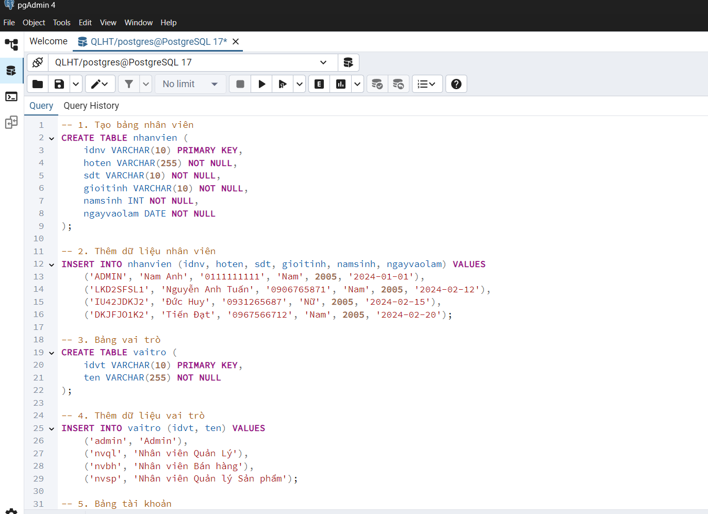
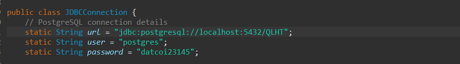
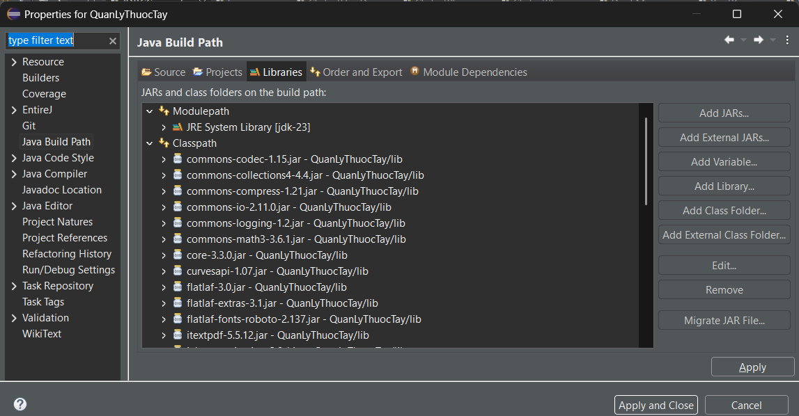

## Pharmacy Management System
- The Pharmacy project is a desktop application that helps pharmacies digitalize their operations.
- It supports product, inventory, customer, supplier, invoice, and employee management, making pharmacy workflows more efficient.
>
## Installation and Running Guide
1. Clone the repository
git clone https://github.com/DavidNA-VN/pharmacy.git
cd pharmacy
2. Setup Database (PostgreSQL)
* Create a database in PostgreSQL (e.g. oop_database).
* Import the provided SQL file (e.g. oop_database.sql) using pgAdmin4 or psql.
## Getting Started
1. Tải source code:
```sh
git clone https://github.com/DavidNA-VN/pharmacy.git
```
2. Copy nội dung file oop_database.sql sau đó dán vào query trong pgAdmin 4 để tạo database 


3. Sử dụng **Eclipse** chọn **File -> Import Project**
4. Sửa phần têm database và mật khẩu trở thành của bạn 
ví dụ tên database là QLHT, mật khẩu là datcoi23145
 
5. Thêm toàn bộ các thư viên trong libs ở phần build path. Nếu sử dụng PG, add thêm thư viện postgresql.jar

6. Run project ở file **Login.java**


